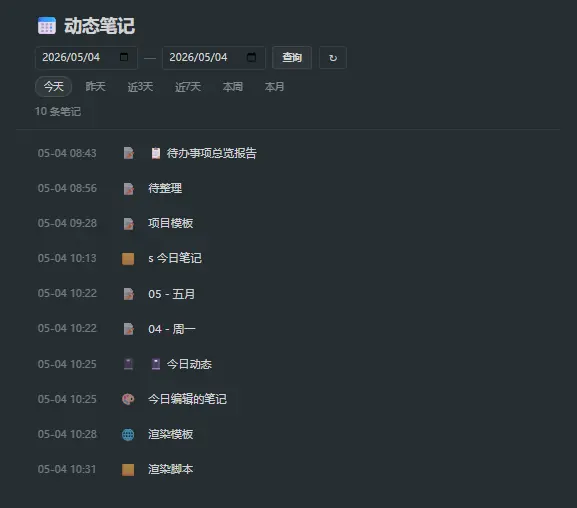

# 📅 Today — Note Activity Viewer

> [中文版](README_CN.md) | [English](README.md)

View note activity within a specified time range.



## Usage

### 1. Manual Import

Create the following note structure in Trilium:

1. Create a `book` type note as a container
2. Create a `render` type note under it
3. Add a `~renderNote` relation pointing to a `text/html` template note
4. Create an `application/javascript;env=frontend` child note under the template

Open the render note to see the dynamic page with date picker controls.

### 2. Using Pre-built Package

Download the archive from Releases, right-click and import at the desired location in the note tree, **disable safe import**. Once imported, you can edit the notes.

## Features

- **Render Note Architecture**: No plugins, no core modifications — pure Trilium built-in mechanism
- **Zero Hardcoded Colors**: Inherits all Trilium theme variables, automatically adapts to light/dark themes
- **Pure Native**: Vanilla JS + CSS, no external dependencies
- **Quick Navigation**: Click note titles to jump directly

## Structure

```
today-node/
├── rendering-template.html   # Render Note HTML template (text/html)
└── frontend-script.js        # Render Note frontend script (application/javascript;env=frontend)
```

## Organization in Trilium

```
搜索脚本 (2GBKQLZRxO3j)
└── 📓 今日动态 (jm63FcGHa5bK)        — book
    └── 今日动态 (JbQWNvvyFntO)      — render
        └── 渲染模板 (4S0E7Tr5yyAQ)  — code (text/html)
            └── 渲染脚本 (7RqzWJHqTbls) — code (application/javascript;env=frontend)
```

## Tech Stack

- Trilium Backend API: `api.searchForNotes()`, `api.runAsyncOnBackendWithManualTransactionHandling()`
- Trilium Frontend API: `api.activateNote()`
- Pure CSS + Vanilla JS, no external dependencies
